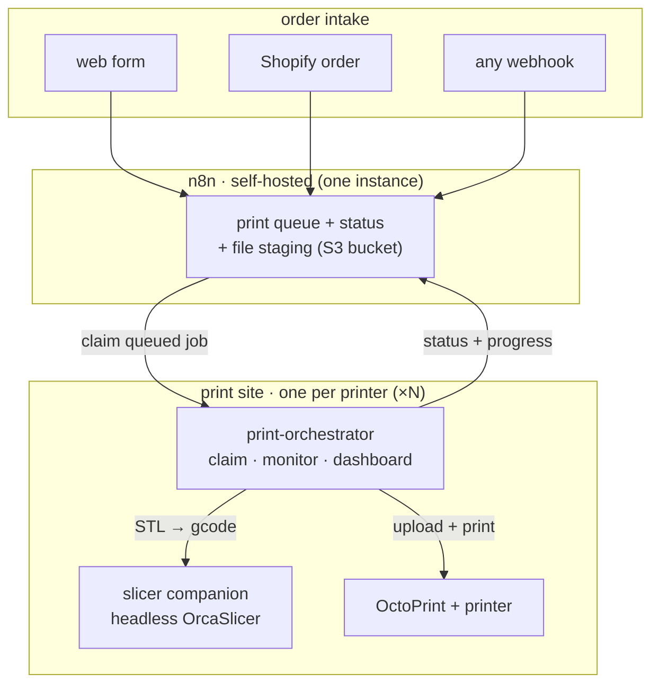

# n8n-2-octoPrint

**A self-hosted, open-source way to turn your OctoPrint 3D printers into an
automated print shop.**

A customer places an order — from a simple web form, your **Shopify** store, or
any webhook — and a printer prints it: the model is auto-sliced, queued, printed,
and tracked, with nobody babysitting the machines. Add capacity by adding
printers; they all pull from one shared queue.

Built on [OctoPrint](https://octoprint.org/) + [n8n](https://n8n.io/). All
Node.js / TypeScript, self-hostable end to end, no cloud lock-in. MIT licensed.

## Why a shop would want this

- **Orders in, prints out.** A web form, a paid Shopify order, or any HTTP
  webhook drops a job in the queue — the farm does the rest: slice → print →
  status.
- **Runs the printers you already have.** Anything OctoPrint drives (Ender 3,
  Prusa, Voron, …). No proprietary hardware, no per-seat SaaS.
- **Scales by adding sites.** One n8n "brain," one lightweight worker per
  printer — even across locations. Jobs are claimed atomically, so two printers
  never grab the same order.
- **Slicing at the edge.** A headless-slicer companion runs next to each
  printer, so there's no central slicing bottleneck and no 5 GB GUI sitting on
  your server.
- **You can actually see it.** A built-in dashboard shows each printer's live
  state, the queue, and recent jobs.
- **Open + self-hosted.** Nothing leaves your network; swap any piece.

> Just want printer events in your automations? The **two-way bridge**
> (OctoPrint events ↔ n8n workflows) works on its own, no print farm required.

## Components

| Component | What it is | Lives in |
| --- | --- | --- |
| **`print-orchestrator`** | The **print-farm worker** (Docker): claims jobs from the n8n queue, pulls the model from any S3-compatible bucket, slices it, prints on OctoPrint, and reports progress — backed by a local Redis/BullMQ queue, with a status **dashboard** + pluggable auth. Run one per printer. | [`print-orchestrator/`](print-orchestrator) |
| **`slicer`** | The **edge slicing companion** (Docker): runs headless OrcaSlicer next to the orchestrator and exposes a small `POST /slice` API (STL → gcode), so slicing happens at the print site instead of a central server. | [`slicer/`](slicer) |
| **`octoprint2n8n`** | The **bridge** (Docker): points at an OctoPrint API, streams its events up to n8n (HMAC-signed), and relays n8n's commands back down through an authenticated proxy. | [`octoprint2n8n/`](octoprint2n8n) |
| **`n8n-nodes-octoprint`** | n8n community node package: an **OctoPrint Trigger** node (printer events → workflow) and an **OctoPrint** action node (commands → printer), plus credentials. | [`n8n-nodes-octoprint/`](n8n-nodes-octoprint) |
| **`octoprint-emulator`** | A **virtual OctoPrint** (REST + SockJS) that simulates a print, so you can build and test the whole thing with no hardware. | [`octoprint-emulator/`](octoprint-emulator) |

## How it fits together

**One n8n instance** is the front door + shared queue; **each print site** runs a
lightweight orchestrator + slicer next to its printer. Add printers by adding
sites — they all claim from the same queue.



The model is staged in any S3-compatible bucket (MinIO, AWS S3, R2, B2…); the
orchestrator downloads it, slices, prints, and **deletes the staged file** once
it's on the printer — so storage stays tiny.

## Order intake (web form, Shopify, or any webhook)

n8n is the front door, so an order can come from anywhere n8n can listen:

- **Web form** — n8n's built-in **Form Trigger** gives you a hosted upload form.
  Customers submit a model; no OctoPrint logins handed out.
- **Shopify** — n8n ships a first-class
  [Shopify integration](https://n8n.io/integrations/shopify/). Drop a **Shopify
  Trigger** in front of the queue and a *paid order automatically becomes a
  queued print* — true print-on-demand, no manual steps.
- **Your website / any system** — have your site `POST` a webhook to n8n with
  the model + details and it kicks off a print.

In every case the workflow stages the file and writes a `queued` row; a site
claims it and prints. The full walkthrough — schema, workflows, and wiring — is
in the **[print-farm guide](docs/print-farm.md)**.

## Quick start

### Run a print site (next to a printer)

```bash
cp print-orchestrator/.env.example print-orchestrator/.env
# set OCTOPRINT_URL/KEY, the n8n queue URLs, S3_* (your bucket), SLICER_URL
cd print-orchestrator && docker compose up -d --build
```

It claims jobs from your n8n queue, slices each one (via the local slicer
companion), prints it, and reports progress. Open the dashboard at
**http://localhost:4848**. Add another printer by running another site with its
own `PRINTER_ID`.

### Or just the event bridge (OctoPrint ⇄ n8n)

```bash
cp octoprint2n8n/.env.example octoprint2n8n/.env   # OCTOPRINT_URL + OCTOPRINT_API_KEY
docker compose up -d --build
```

Then install `n8n-nodes-octoprint` (**Settings → Community Nodes**), add an
**OctoPrint Trigger** node, and point the bridge's `N8N_WEBHOOK_URL` at it. See
[`octoprint2n8n/`](octoprint2n8n/README.md) and
[`n8n-nodes-octoprint/`](n8n-nodes-octoprint/README.md).

## Dashboard

The orchestrator serves a local **status dashboard** (printer state + live
progress, queue depth, recent jobs, pipeline config) behind a **pluggable auth
layer** — a built-in local username/password provider, with a clean interface
for adding external OAuth/OIDC providers. See
[print-orchestrator/README.md#dashboard](print-orchestrator/README.md#dashboard).

## Test without a printer

The repo ships a **virtual OctoPrint** and a full local stack, so you can try
everything with no hardware:

```bash
# fast, offline: emulator → bridge
cd octoprint-emulator && npm i && npm run build && cd ..
cd octoprint2n8n     && npm i && npm run build && cd ..
node scripts/e2e.mjs

# the whole thing in Docker: real OctoPrint (Virtual Printer) + bridge + n8n
docker compose -f demo/docker-compose.yml up -d --build
bash demo/setup.sh && bash demo/print.sh   # watch n8n's Executions tab
```

More in [`demo/`](demo/README.md). The `scripts/verify-*.mjs` checks cover the
emulator, real OctoPrint, and the full stack through n8n.

## Security model

- **Events → n8n** are HMAC-signed with a shared secret; the Trigger node
  verifies them.
- **Commands → printer** go through the bridge's Bearer-authenticated,
  allow-listed proxy — the OctoPrint API key stays on the bridge.
- **File staging** uses signed S3 requests; the orchestrator fetches over
  http/https only (never cloud-metadata) and deletes the object after fetch.
- **The dashboard** requires login (scrypt-hashed local credentials, HMAC
  session cookies) and is auth-provider-pluggable.
- Run everything behind HTTPS in production. `.env` files are git-ignored — keep
  secrets there. See [SECURITY.md](SECURITY.md).

## Why not dockerize OctoPrint itself?

OctoPrint needs direct USB/serial access to the printer, which is fiddly to pass
through a container reliably. Run OctoPrint the normal way (OctoPi, native, or —
for testing — its built-in **Virtual Printer** plugin) and point these tools at
it.

## Repository layout

```
n8n-2-octoPrint/
├── print-orchestrator/    # the print-farm worker + dashboard (Docker image)
├── slicer/                # the edge slicing companion (headless OrcaSlicer)
├── octoprint2n8n/         # the OctoPrint ⇄ n8n bridge (Docker image)
├── n8n-nodes-octoprint/   # the n8n community node package (Trigger + Action)
├── octoprint-emulator/    # a virtual OctoPrint for testing without a printer
├── demo/                  # one-command full stack (OctoPrint + bridge + n8n)
├── docs/print-farm.md     # the print-shop implementation guide
├── scripts/               # e2e + real-OctoPrint + full-stack verification
└── .github/workflows/     # CI: builds all packages, runs e2e, builds images
```

## Contributing

Issues and PRs welcome — see [CONTRIBUTING.md](CONTRIBUTING.md) and the
[Code of Conduct](CODE_OF_CONDUCT.md). For security reports, see
[SECURITY.md](SECURITY.md).

## License

[MIT](LICENSE) © 2026 Roger Hernandez (amosroger91)
