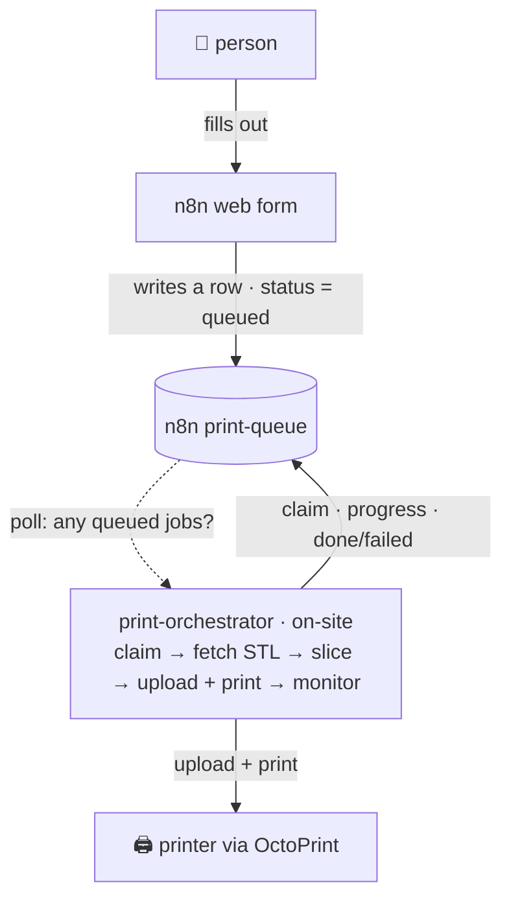

# Running a print farm with n8n-2-octoPrint

This guide explains the whole stack and walks through wiring it into a print
farm where **someone fills out a web form and a printer prints their model** —
with the queue, slicing, printing, and status all automated.

It's written to be generic: any shop with one or more OctoPrint-connected
printers can follow it.

---

## What it does for a print farm



You get:

- **A front door** anyone can use — an n8n form, no OctoPrint logins handed out.
- **A durable queue** — jobs survive restarts; one print runs at a time per box
  (Redis/BullMQ).
- **Hands-off slicing** — STL in, gcode out, with your printer's real profile.
- **Live status** — every job's state flows back to n8n (and a local dashboard).
- **Self-hosted + open** — nothing leaves your network.

---

## The stack

| Piece | Runs where | Role |
| --- | --- | --- |
| **n8n** | your server | the form, the queue (a Data Table), and two webhooks the orchestrator talks to |
| **slicer API** | your server | an HTTP wrapper around your slicer: STL → gcode |
| **`print-orchestrator`** | a box **next to each printer** | claims jobs, slices, prints, reports status; has a local Redis + a status dashboard |
| **OctoPrint** | on/next to the printer | drives the actual printer |
| *(optional)* **`octoprint2n8n` bridge** | next to the printer | streams live printer events into n8n for event-driven workflows |

One orchestrator runs per printer (it prints one job at a time). They all poll
the same n8n queue and claim jobs independently.

---

## The data flow / contract

The orchestrator talks to n8n over **two webhooks** plus your **slicer**. Nothing
else is assumed, so you can back the queue with whatever you like (this guide
uses n8n **Data Tables**).

**1. Get claimable jobs** — `GET N8N_QUEUE_URL` returns the rows that are still
`queued`:

```jsonc
[
  { "id": "row-123", "stlUrl": "https://files.example/benchy.stl",
    "name": "benchy", "material": "PLA", "color": "black" }
]
```

> Return **only** `status = "queued"` rows, so a job that's already being printed
> isn't claimed twice.

**2. Report status** — the orchestrator `POST`s to `N8N_STATUS_URL` at each step;
your workflow writes it onto the row:

```jsonc
{ "id": "row-123", "printerId": "shop-pi-1", "status": "printing",
  "progress": 42, "stats": { "filamentUsedGrams": 8.1, "printTimeHours": 0.6 },
  "at": "2026-06-18T06:18:00.000Z" }
```

`status` is one of `claimed | slicing | uploading | printing | done | failed |
cancelled`.

**3. Slice** — for a job with `stlUrl`, the orchestrator `POST`s the STL to your
`SLICER_URL` and expects gcode back (raw, or JSON with `gcodeBase64`/`gcode`/
`gcodeUrl`). A job that already has a `gcodeUrl` skips slicing.

---

## The print-queue schema

A simple Data Table (adjust names to taste — the orchestrator maps a few
aliases, and the field names below are what it looks for):

| Column | Set by | Notes |
| --- | --- | --- |
| `id` | n8n (row id) | the job id |
| `status` | form → `queued`; orchestrator updates it | drives everything |
| `name` | form | friendly label / filename |
| `stlUrl` | form | URL of the STL/3MF to slice |
| `gcodeUrl` | form *(optional)* | pre-sliced gcode; skips slicing |
| `material` / `color` | form | e.g. PLA / black |
| `quantity` | form | (orchestrator prints one; fan out in n8n for more) |
| `progress` | orchestrator | 0–100 |
| `printerId` | orchestrator | which box claimed it |
| `stats` | orchestrator | filament grams + print hours |
| `submittedBy` / `createdAt` | form | |
| `updatedAt` | orchestrator | |

---

## n8n setup (the "front door")

### Workflow A — the request form

1. **Form Trigger** node — title it (e.g. "Submit a print"), add fields:
   *Name*, *Model STL URL*, *Material* (dropdown: PLA / PETG / TPU), *Color*,
   *Quantity* (number).
2. **Edit Fields (Set)** node — map the form fields to the schema and add
   `status = "queued"`, `createdAt = {{$now}}`.
3. **Data Table → Insert** — into your `print-queue` table.
4. **Activate.** Your form is live at `https://<your-n8n>/form/<path>`.

### Workflow B — the queue API (two webhooks)

1. **Webhook** (GET, path `print-queue`) → **Data Table → Get row(s)** with a
   filter `status = "queued"` → **Respond to Webhook** returning the rows.
2. **Webhook** (POST, path `print-status`) → **Data Table → Update row** matched
   on `id`, setting `status`, `progress`, `stats`, `updatedAt = {{$now}}` →
   **Respond to Webhook** with `{"ok": true}`.
3. **Activate.** You now have
   `https://<your-n8n>/webhook/print-queue` and `.../webhook/print-status`.

> Protect the webhooks (n8n header-auth or a token) and pass it to the
> orchestrator as `N8N_AUTH_HEADER`.

---

## The slicer

The orchestrator needs an HTTP endpoint that turns an STL into gcode. If you run
OctoPrint with OrcaSlicer/PrusaSlicer/Cura available, wrap the slicer's CLI in a
tiny service:

- `POST /slice` — multipart `file` (the STL) + `profile` (+ `material`).
- returns the gcode (raw body, or JSON with `gcodeBase64` / `gcodeUrl`).

Point the orchestrator at it with `SLICER_URL`, `SLICER_USERNAME/PASSWORD`, and
`SLICER_PROFILE`. The orchestrator parses filament + time out of the gcode
comments, so you get those stats even if the slicer returns only gcode.

Until your slicer is wired, the form can submit a **`gcodeUrl`** (a pre-sliced
file) and everything else works.

---

## The orchestrator (one per printer)

On the box next to each printer:

```bash
cp print-orchestrator/.env.example print-orchestrator/.env
# set OCTOPRINT_URL + OCTOPRINT_API_KEY, SLICER_*, and:
#   N8N_QUEUE_URL = https://<your-n8n>/webhook/print-queue
#   N8N_STATUS_URL = https://<your-n8n>/webhook/print-status
#   PRINTER_ID = a name for this box
cd print-orchestrator && docker compose up -d --build
```

Watch it on the dashboard at `http://<box>:4848`.

---

## Putting it together

1. A customer opens the n8n form and submits a model → a `queued` row appears.
2. The orchestrator polls, claims it (`status = claimed`), slices, uploads, and
   starts the print — posting `printing` + progress back to the row.
3. On completion it sets `done` (or `failed`), and the dashboard + the n8n row
   both reflect it.

Add more printers by running another orchestrator with its own `PRINTER_ID`.

---

## Testing

You don't need a printer (or even n8n) to exercise this:

```bash
node scripts/e2e.mjs                 # emulator -> bridge (offline)
print-orchestrator/stage-a.mjs       # queue -> print on a (virtual) printer
print-orchestrator/dashboard-test.mjs# dashboard login + status
```

The full pull-pipeline (n8n queue → orchestrator → print → status) is exercised
by the project's verification runs against a real OctoPrint.
